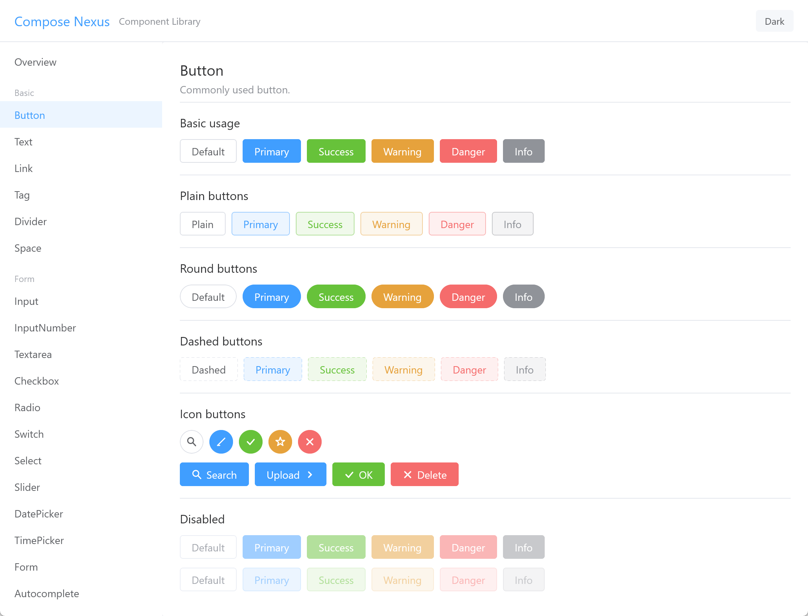

# Compose Nexus

[English](#english) | [中文](#中文)

---

## English

Compose Multiplatform UI component library inspired by [Element Plus](https://element-plus.org/), targeting Android, iOS, Desktop (JVM), Web (JS/WasmJS).

### Screenshot



### Project Structure

```
compose-nexus/
├── compose-nexus-core/   # KMP UI component library
├── sample/               # Multiplatform demo app (commonMain + platform entries)
└── sample-android/       # Android application (depends on :sample)
```

- **compose-nexus-core** — Core library providing all components as a KMP library with `androidLibrary` target.
- **sample** — Multiplatform demo showcasing all components. Contains `commonMain` (shared UI), `androidMain` (Android entry), `jvmMain`, `iosMain`, `webMain`.
- **sample-android** — Pure Android app shell. Depends on `:sample` and calls `AndroidContent()` from `sample/androidMain`.

### Components

#### Theme (8)

ColorScheme, Typography, Sizes, Shapes, Shadows, Motion, NexusTheme, Types

#### Foundation (4)

BuildModifier, LocalContentColor, LocalTextStyle, ProvideContentColorTextStyle

#### Controls (46)

| Category | Components |
|---|---|
| Basic | Button, Text, Icon, Link, Tag, Divider, Space |
| Form | Input, InputNumber, Textarea, Checkbox, Radio, Switch, Select, Slider, DatePicker, TimePicker, Form, Autocomplete, InputTag, Cascader, Transfer, Mention |
| Data Display | Table, Tree, Pagination, Progress, Avatar, Skeleton, Empty, Calendar, VirtualList, InfiniteScroll, TreeSelect |
| Navigation | Menu, TreeMenu, Steps, Breadcrumb, Tabs, Dropdown |
| Feedback | Alert, Message, Notification, Loading, Tooltip, Tour, SearchBar |

#### Containers (5)

Card, Collapse, Dialog, Drawer, Carousel

#### Page Templates (10)

SearchSelectPage, CrudTablePage, FormPage, DetailPage, LoginPage, SettingsPage, DashboardPage, TreeListPage, WizardPage, ErrorPage

### Build & Run

#### Desktop (JVM)

```shell
./gradlew :sample:run
```

#### Android

```shell
./gradlew :sample-android:assembleDebug
```

Or run `sample-android` directly from Android Studio.

#### Web (WasmJS)

```shell
./gradlew :sample:wasmJsBrowserDevelopmentRun
```

#### Web (JS)

```shell
./gradlew :sample:jsBrowserDevelopmentRun
```

#### iOS

Open the `iosApp` directory in Xcode, or use the run configuration in your IDE.

### Tech Stack

- Kotlin 2.3.0
- Compose Multiplatform 1.10.0
- AGP 8.11.2
- Targets: Android, iOS (arm64 / simulatorArm64), JVM, JS, WasmJS

---

## 中文

基于 [Element Plus](https://element-plus.org/) 设计风格的 Compose Multiplatform UI 组件库，支持 Android、iOS、桌面端 (JVM)、Web (JS/WasmJS) 多平台。

### 截图


### 项目结构

```
compose-nexus/
├── compose-nexus-core/   # KMP UI 组件库
├── sample/               # 多平台示例应用 (commonMain + 各平台入口)
└── sample-android/       # Android 应用 (依赖 :sample)
```

- **compose-nexus-core** — 核心组件库，以 KMP 库形式提供所有组件，包含 `androidLibrary` 目标。
- **sample** — 多平台示例应用，展示所有组件。包含 `commonMain`（共享 UI）、`androidMain`（Android 入口）、`jvmMain`、`iosMain`、`webMain`。
- **sample-android** — 纯 Android 应用壳。依赖 `:sample`，调用 `sample/androidMain` 中的 `AndroidContent()`。

### 组件列表

#### 主题 (8)

ColorScheme（配色方案）、Typography（排版）、Sizes（尺寸）、Shapes（形状）、Shadows（阴影）、Motion（动效）、NexusTheme（主题）、Types（类型）

#### 基础设施 (4)

BuildModifier、LocalContentColor、LocalTextStyle、ProvideContentColorTextStyle

#### 控件 (46)

| 分类 | 组件 |
|---|---|
| 基础 | Button（按钮）、Text（文本）、Icon（图标）、Link（链接）、Tag（标签）、Divider（分割线）、Space（间距） |
| 表单 | Input（输入框）、InputNumber（数字输入框）、Textarea（文本域）、Checkbox（多选框）、Radio（单选框）、Switch（开关）、Select（选择器）、Slider（滑块）、DatePicker（日期选择器）、TimePicker（时间选择器）、Form（表单）、Autocomplete（自动补全）、InputTag（标签输入）、Cascader（级联选择器）、Transfer（穿梭框）、Mention（提及） |
| 数据展示 | Table（表格）、Tree（树形控件）、Pagination（分页）、Progress（进度条）、Avatar（头像）、Skeleton（骨架屏）、Empty（空状态）、Calendar（日历）、VirtualList（虚拟列表）、InfiniteScroll（无限滚动）、TreeSelect（树形选择） |
| 导航 | Menu（菜单）、TreeMenu（树形菜单）、Steps（步骤条）、Breadcrumb（面包屑）、Tabs（标签页）、Dropdown（下拉菜单） |
| 反馈 | Alert（警告）、Message（消息提示）、Notification（通知）、Loading（加载）、Tooltip（文字提示）、Tour（漫游式引导）、SearchBar（搜索栏） |

#### 容器 (5)

Card（卡片）、Collapse（折叠面板）、Dialog（对话框）、Drawer（抽屉）、Carousel（走马灯）

#### 页面模板 (10)

SearchSelectPage（搜索选择页）、CrudTablePage（增删改查表格页）、FormPage（表单页）、DetailPage（详情页）、LoginPage（登录页）、SettingsPage（设置页）、DashboardPage（仪表盘页）、TreeListPage（树形列表页）、WizardPage（向导页）、ErrorPage（错误页）

### 构建与运行

#### 桌面端 (JVM)

```shell
./gradlew :sample:run
```

#### Android

```shell
./gradlew :sample-android:assembleDebug
```

或在 Android Studio 中直接运行 `sample-android`。

#### Web (WasmJS)

```shell
./gradlew :sample:wasmJsBrowserDevelopmentRun
```

#### Web (JS)

```shell
./gradlew :sample:jsBrowserDevelopmentRun
```

#### iOS

在 Xcode 中打开 `iosApp` 目录运行，或使用 IDE 中的运行配置。

### 技术栈

- Kotlin 2.3.0
- Compose Multiplatform 1.10.0
- AGP 8.11.2
- 目标平台：Android、iOS (arm64 / simulatorArm64)、JVM、JS、WasmJS
